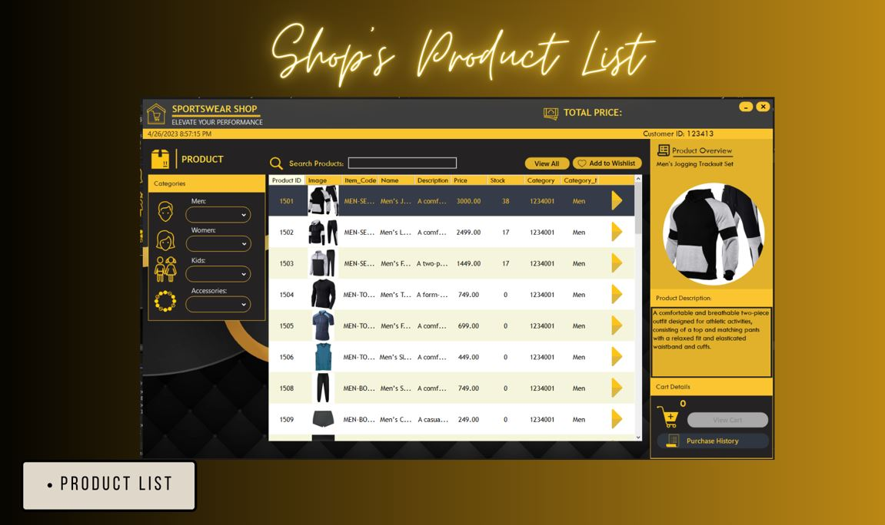
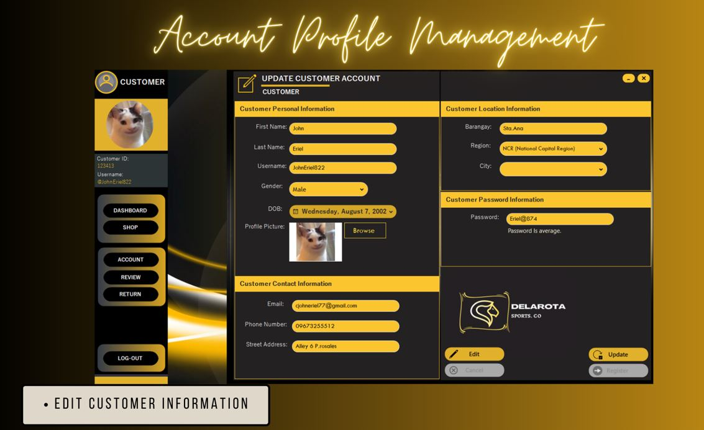
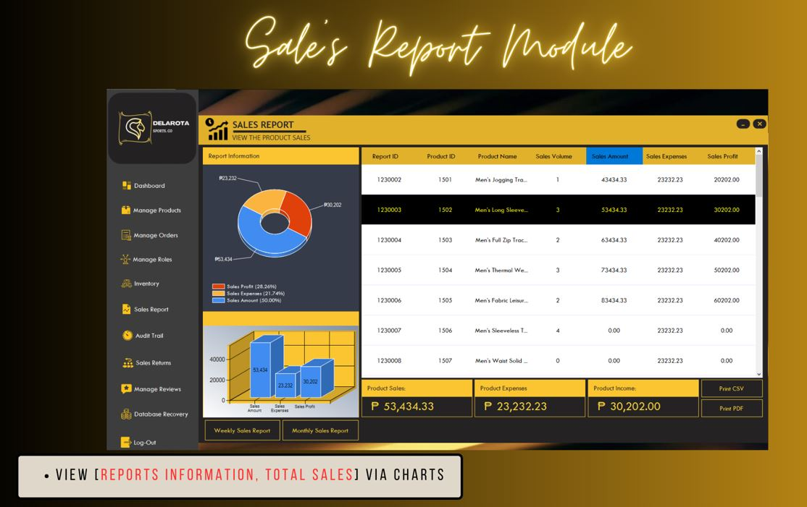
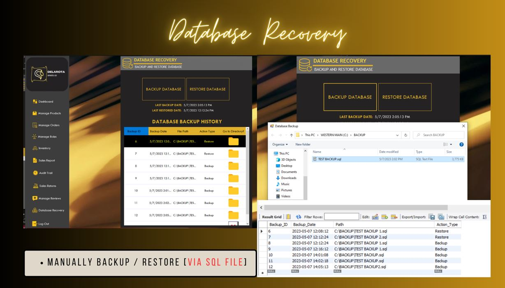

# Project Description 🚀️

DELAROTA Sports Co. is a local sports equipment and apparel company that provides high-quality products to customers who are passionate about sports. The company recognizes that convenience and accessibility are crucial in reaching its target audience, which is why it has embraced online shopping as a way to make its products available to customers wherever they may be. 

Through DELAROTA Sports Co.'s online store, customers can easily browse through a wide selection of sports gear and apparel without having to leave the comfort of their own homes. This makes it more convenient for customers who do not have the time to go to physical stores, especially during rush hours or heavy traffic.

Furthermore, online shopping allows DELAROTA Sports Co. to expand its reach beyond local markets, connecting with customers all over the Philippines and even abroad. With the help of e-commerce, the company can offer its products to a wider audience and promote its brand to more potential customers.

# How It Works? 🚀️

The platform includes an Account Registration feature for new users and a Password Reset feature for users who have forgotten their passwords. In addition, we provide a product list with accurate information to help buyers make informed purchasing decisions. As the administrator, you have access to manage the accounts of buyers. You can also view the list of buyers and suppliers using the platform. The platform also includes features for managing product stocks and modifying product prices. Admins using our platform can manage their listed products, view their orders, and monitor their sales through generated reports. Our audit trail feature tracks user actions to ensure accountability and transparency. In summary, THE e-Commerce platform provides a secure and user-friendly online shopping experience for buyers while offering comprehensive management features for administrators, suppliers, and customers.

# Sample Screenshots 🚀️

